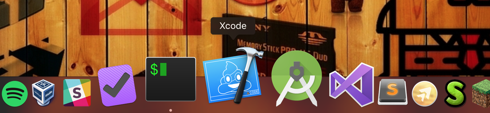

# PoopCode

Poopcode is a replacement for the original icon of Xcode. It reflects the feeling of the developers when working with Xcode.



## Installation

⚠️  Before overriding the icon, please make a backup in case you want to restore the original one...

```
$ cp /Applications/Xcode.app/Contents/Resources/Xcode.icns ~/wherever/you/want
```

To to use the new icon just override the icon of your Xcode installation with the one included in this repo.

```
$ git clone https://github.com/dcordero/PoopCode.git
$ cp PoopCode/PoopCode.icns /Applications/Xcode.app/Contents/Resources/Xcode.icns
```

Too force macOS to refresh the cached icons

```
$ touch /Applications/Xcode.app
$ sudo killall Finder Dock
```

